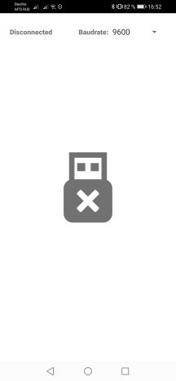
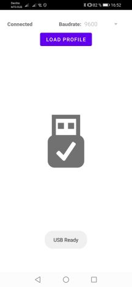
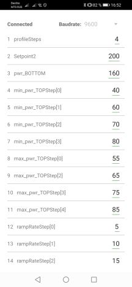
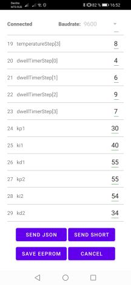
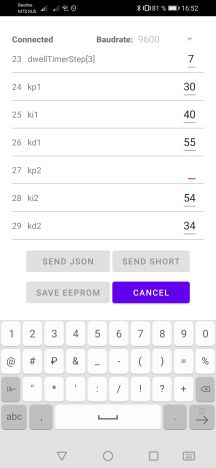
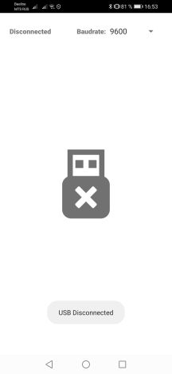
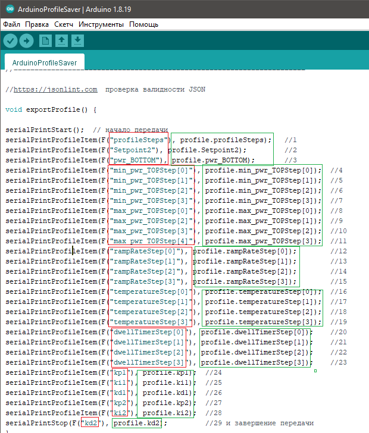
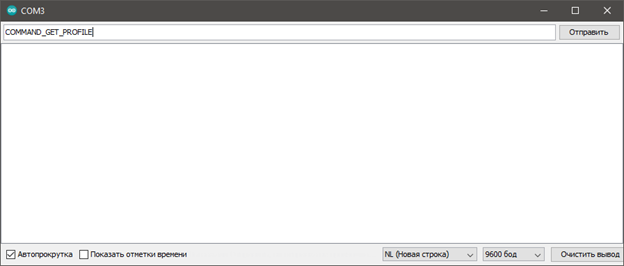
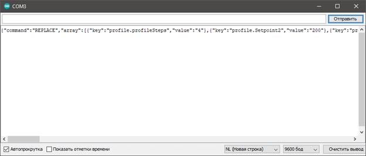
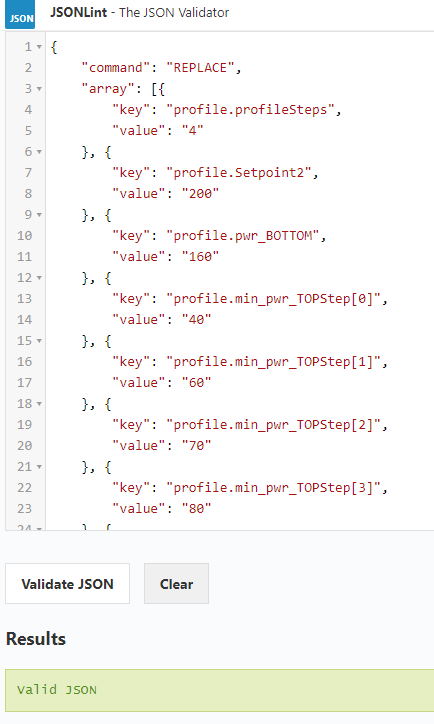

# Profile Editor for BGA rework stations

**Приложение для обмена данными с ардуино через USB-Serial port**
#Инструкция


Минимальная версия Android  - 4.4
Для работы потребуется OTG USB кабель и поддержка OTG в смартфоне/планшете

## 🔗 Links
- [Пример адаптации ардуино скетча](img/ArduinoProfileSaver.ino)
- [Ссылка на ютуб канал](https://youtu.be/axgUR_a76wE)
- [Ссылка на приложение Google Play](https://play.google.com/store/apps/details?id=com.jagerlipton.bgaprofileeditor "Ссылка на приложение")

## 📷 ScreenShots
|**Стартовый экран**|**Автоконнект при подключении**|**Загрузка профиля**|
| :------------ | :------------ | :------------ |
||||
|**Кнопки управления**|**Валидация данных**|**Автоотключение**|
||||

## 🔪 Адаптация прошивки станции
>Процесс адаптации рассчитан скорее на самих авторов прошивок, а не пользователей. Требует немного знаний прошивки и программирования. **Автор приложения консультаций не оказывает.** Вопросы только по пожеланиям, предложениям и багам.

####1. Добавление кода парсинга команд из serial порта 
Если такого в прошивке еще не было, то нужно найти в коде главный цикл скетча и скопировать/вставить туда **serialParser();**

```c
void loop() {
serialParser(); // это
}```

####2. Копируем служебные функции для обработки команд приложения:

```c
void serialParser() // здесь распознаются команды из телефона
{
if (Serial.available()>0) {
String data = Serial.readStringUntil('\n');
if (data.indexOf("COMMAND_GET_PROFILE")!=-1){exportProfile(); serialPrintReady(); }
if (data.indexOf("SHORT_PROFILE")!=-1){/*parsingShort(data);*/serialPrintReady();}
if (data.indexOf("JSON_PROFILE")!=-1){parsingJSON(data); serialPrintReady(); }
if (data.indexOf("COMMAND_SAVE_PROFILE")!=-1){saveProfile(); serialPrintReady(); }
}
}
void serialPrintStart(){
Serial.print(F("{\"command\":\"REPLACE\",\"array\":["));
}
void serialPrintProfileItem(String key, int value){
Serial.print("{\"key\":\"" + key + "\",\"value\":\"" + String(value)+ "\"}," );
}
void serialPrintStop(String key, int value){
Serial.print("{\"key\":\"" + key + "\",\"value\":\"" + String(value)+ "\"}]}" );
Serial.println();
}
void serialPrintReady(){
Serial.println(F("{\"command\":\"READY\"}"));
}
```
####3. Создание функций для отправки профиля из станции и приема их обратно
   - exportProfile(); 
   - parsingShort(String input);
   - parsingJSON(String data);
   - saveProfile();

####3.1 Создание exportProfile();

Итак предположим в станции имеется текущий профиль, структура, куда загружается профиль из ЕЕПРОМ и используется при пайке. Он хранится в структуре вида
```c
//---секция профиля---//
struct pr {                                         // основные поля профиля
  byte profileSteps;                           // количество шагов профиля
  int Setpoint2;                                 // установленная температура(уставка)НИ
  byte pwr_BOTTOM;                       // максимальная мощность нижнего нагревателя
  byte min_pwr_TOPStep[4];            // минимальная мощность верхнего нагревателя
  byte max_pwr_TOPStep[4];            // максимальная мощность верхнего нагревателя
  byte rampRateStep[4];                   // скорости роста температуры по шагам
  byte temperatureStep[4];               // заданные температуры для шагов профиля ВИ
  byte dwellTimerStep[4];                 // установленное время перехода на следующий шаг (полочка на шаге)
  byte kp1;                                     // пропорциональный коэффициент ПИД для ВИ
  byte ki1;                                      // интегральный коэффициент ПИД для ВИ
  byte kd1;                                    // дифференциальный коэффициент ПИД для ВИ
  byte kp2;                                    // пропорциональный коэффициент ПИД для НИ
  byte ki2;                                     // интегральный коэффициент ПИД для НИ
  byte kd2;                                    // дифференциальный коэффициент ПИД для НИ
};
byte SizeProfile = sizeof(pr);         // длина поля данных
pr profile;                                      // переменная, в которой лежит текущий профиль
```
Для реализации экспорта всех полей (или полей, которые необходимо будет редактировать ) нужно изобразить следующую конструкцию:


>Красные – описание полей, зеленые – их значение

```c
serialPrintStart(); // начало передачи
…
…serialPrintProfileItem(F("name"), profile.name);
…
serialPrintStop(F("name "), profile. name); //завершение передачи
```
>Полный текст экспорта профиля можно посмотреть по ссылке в примере ардуино адаптации

Итак. Экспорт профиля готов. Правильность экспорта необходимо проверить. Для этого нужно загрузить полученный скетч в ардуино, зайти в монитор порта и вставить туда команду **COMMAND_GET_PROFILE**


Если обработка команд работает, то в монитор придет ответ:


```c
{"command":"REPLACE","array":[{"key":"profile.profileSteps","value":"4"},{"key":"profile.Setpoint2","value":"200"},{"key":"profile.pwr_BOTTOM","value":"160"},{"key":"profile.min_pwr_TOPStep[0]","value":"40"},{"key":"profile.min_pwr_TOPStep[1]","value":"60"},{"key":"profile.min_pwr_TOPStep[2]","value":"70"},{"key":"profile.min_pwr_TOPStep[3]","value":"80"},{"key":"profile.max_pwr_TOPStep[0]","value":"55"},{"key":"profile.max_pwr_TOPStep[1]","value":"65"},{"key":"profile.max_pwr_TOPStep[2]","value":"75"},{"key":"profile.max_pwr_TOPStep[3]","value":"85"},{"key":"profile.rampRateStep[0]","value":"5"},{"key":"profile.rampRateStep[1]","value":"10"},{"key":"profile.rampRateStep[2]","value":"15"},{"key":"profile.rampRateStep[3]","value":"20"},{"key":"profile.temperatureStep[0]","value":"5"},{"key":"profile.temperatureStep[1]","value":"6"},{"key":"profile.temperatureStep[2]","value":"7"},{"key":"profile.temperatureStep[3]","value":"8"},{"key":"profile.dwellTimerStep[0]","value":"4"},{"key":"profile.dwellTimerStep[1]","value":"6"},{"key":"profile.dwellTimerStep[2]","value":"9"},{"key":"profile.dwellTimerStep[3]","value":"7"},{"key":"profile.kp1","value":"30"},{"key":"profile.ki1","value":"40"},{"key":"profile.kd1","value":"55"},{"key":"profile.kp2","value":"55"},{"key":"profile.ki2","value":"54"},{"key":"profile.kd2","value":"34"}]}
```
>Текст ответа из тестового примера

Далее нужно перейти на сайт https://jsonlint.com, вставить этот результат туда и проверить валидность JSON строки.
Сайт должен вернуть зеленый результат:


Пока результат не будет валидным, приложение не будет принимать экспорт данных.

####3.2 Создание parsingShort(String input);
Функция parsingShort(String input); принимает данные из приложения, которые отправляются после нажатия кнопки "ExportShort". Это самый простой, быстрый способ передачи профиля обратно, но без возможности проверки на ошибки при передаче. 

Данные имеют вид:
```c
SHORT_PROFILE:4,20,10,20,30,40,40,50,60,70,5,6,7,8,6,7,8,9,5,5,5,5,100,100,100,100,100,100,
```
**В конце строки всегда должен быть разделитель “,”**
>Благодаря разделителям строка разбивается на массив чисел, после чего каждой позиции профиля нужно присвоить элементы этого массива. Способ без проверки на ошибки, в связи с чем будьте крайне внимательны и сверяйте записанные данные.

```c
void parsingShort (String input) {
int end;
int outputArray[29]; // количество полей профиля
int counter = 0;
input.remove(0,input.indexOf(":")+1);
while((end=input.indexOf(","))!=-1){
String num = input.substring(0,end);
input= input.substring(end+1,input.length());
outputArray[counter]=num.toInt();
counter++;
}
profile.profileSteps=outputArray[0]; // 1
profile.Setpoint2=outputArray[1]; // 2
profile.pwr_BOTTOM=outputArray[2]; //3
profile.min_pwr_TOPStep[0]=outputArray[3]; //4
profile.min_pwr_TOPStep[1]=outputArray[4]; //5
profile.min_pwr_TOPStep[2]=outputArray[5]; //6
profile.min_pwr_TOPStep[3]=outputArray[6]; //7
profile.max_pwr_TOPStep[0] = outputArray[7]; //8
profile.max_pwr_TOPStep[1] = outputArray[8]; //9
profile.max_pwr_TOPStep[2] = outputArray[9]; //10
profile.max_pwr_TOPStep[3] = outputArray[10]; //11
profile.rampRateStep[0] = outputArray[11]; //12
profile.rampRateStep[1] = outputArray[12]; //13
profile.rampRateStep[2] = outputArray[13]; //14
profile.rampRateStep[3] = outputArray[14]; //15
profile.temperatureStep[0]=outputArray[15]; //16
profile.temperatureStep[1]=outputArray[16]; //17
profile.temperatureStep[2]=outputArray[17]; //18
profile.temperatureStep[3]=outputArray[18]; //19
profile.dwellTimerStep[0] = outputArray[19]; //20
profile.dwellTimerStep[1] = outputArray[20]; //21
profile.dwellTimerStep[2] = outputArray[21]; //22
profile.dwellTimerStep[3] = outputArray[22]; //23
profile.kp1=outputArray[23]; //24
profile.ki1=outputArray[24]; //25
profile.kd1=outputArray[25]; //26
profile.kp2 = outputArray[26]; //27
profile.ki2 = outputArray[27]; //28
profile.kd2 = outputArray[28]; //29
}
```
>Каждый элемент массива копируется в соответствующее поле текущего профиля, тем самым достигается замена текущих значений, после чего можно будет его испытывать или сохранять

####3.3 Создание parsingJSON(String data);
```c
void parsingJSON (String data) {
  //
  }
```
Маломощная ардуино аля Atmega 328p имеет недостаточно ресурсов для работы с целыми JSON строками. Если у вас в станции используются другие платы, то реализовать парсинг можно следующим образом. Из приложения в ардуино передается JSON строка следующего вида:
```c
{"array":[{"key":"profile.profileSteps","value":"4"},{"key":"profile.Setpoint2","value":"200"},{"key":"profile.pwr_BOTTOM","value":"160"},{"key":"profile.min_pwr_TOPStep[0]","value":"40"},{"key":"profile.min_pwr_TOPStep[1]","value":"60"},{"key":"profile.min_pwr_TOPStep[2]","value":"70"},{"key":"profile.min_pwr_TOPStep[3]","value":"80"},{"key":"profile.max_pwr_TOPStep[0]","value":"55"},{"key":"profile.max_pwr_TOPStep[1]","value":"65"},{"key":"profile.max_pwr_TOPStep[2]","value":"75"},{"key":"profile.max_pwr_TOPStep[3]","value":"85"},{"key":"profile.rampRateStep[0]","value":"5"},{"key":"profile.rampRateStep[1]","value":"10"},{"key":"profile.rampRateStep[2]","value":"15"},{"key":"profile.rampRateStep[3]","value":"20"},{"key":"profile.temperatureStep[0]","value":"5"},{"key":"profile.temperatureStep[1]","value":"6"},{"key":"profile.temperatureStep[2]","value":"7"},{"key":"profile.temperatureStep[3]","value":"8"},{"key":"profile.dwellTimerStep[0]","value":"4"},{"key":"profile.dwellTimerStep[1]","value":"6"},{"key":"profile.dwellTimerStep[2]","value":"9"},{"key":"profile.dwellTimerStep[3]","value":"7"},{"key":"profile.kp1","value":"30"},{"key":"profile.ki1","value":"40"},{"key":"profile.kd1","value":"55"},{"key":"profile.kp2","value":"55"},{"key":"profile.ki2","value":"54"},{"key":"profile.kd2","value":"34"}],"command":"JSON_PROFILE"}
```
Для создания JSON обработчика можно вставить вашу JSON строку в http://arduinojson.org/v6/assistant/  и получить готовый скетч для парсинга в ардуино.

####3.4 Создание saveProfile(); 
```c
void saveProfile (){
  //
 }

```
Реализация сохранения профилей должна быть заимствована (переиспользована) из существующей функции сохранения профилей в ЕЕПРОМ (если конечно она присутствует в коде прошивки). 

На этом адаптация для версии 1.0 закончена. 

####Планируемые изменения:
- добавление bluetooth
- способ передачи профиля с проверкой целостности


